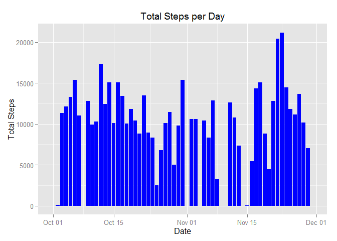
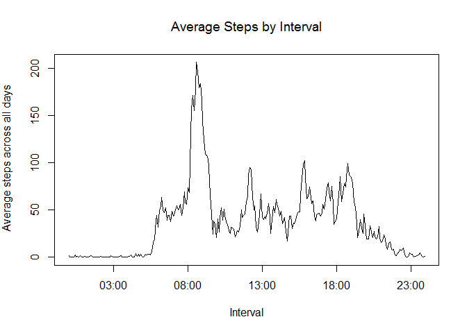
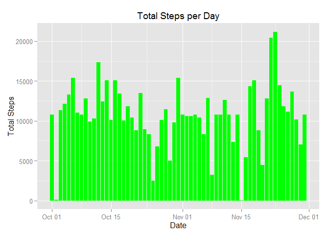
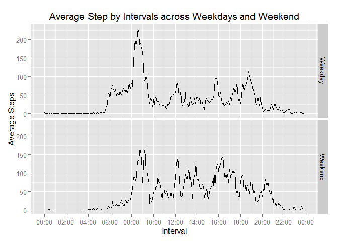

# Reproducible Research: Peer Assessment 1


## Loading and preprocessing the data

Below is the R code which loads and preprocess the data.


```r
df.data <-read.csv("activity.csv")

# create a Datetime class Date column 
df.data["Date"] <- NA
df.data$Date <- as.POSIXct(as.character(df.data$date), format = "%Y-%m-%d")
```

## What is mean total number of steps taken per day?

The below R code will produce a histogram that illustrates the total steps taken per day. Missing values are removed.


```r
library("ggplot2")
```

```
## Warning: package 'ggplot2' was built under R version 3.1.3
```

```r
df.totalSteps.day.rmNA <-with(df.data, aggregate(steps, by=list(Date = Date), FUN=sum, na.rm=TRUE))

names(df.totalSteps.day.rmNA)[2] <- "TotalSteps"

ggplot(data=df.totalSteps.day.rmNA) + 
    geom_histogram(aes(x=Date, y=TotalSteps), fill="blue", stat="identity")+
    xlab("Date") +
    ylab("Total Steps") +
    ggtitle(expression("Total Steps per Day")) 
```

 

Mean total steps per day:


```r
mean(df.totalSteps.day.rmNA$TotalSteps)
```

```
## [1] 9354.23
```

Median total steps per day:


```r
median(df.totalSteps.day.rmNA$TotalSteps)
```

```
## [1] 10395
```
## What is the average daily activity pattern?

The below R code create a line graph which illustrates the daily activity pattern (mean steps by 5-minute interval). Missing values are removed.


```r
df.meanSteps.interval.rmNA <-with(df.data, aggregate(steps, by=list(Interval = interval), 
                                                     FUN=mean, na.rm=TRUE))

names(df.meanSteps.interval.rmNA)[2] <- "MeanSteps"


# create a interval column of Datetime class

df.meanSteps.interval.rmNA["TimeInterval"] <- NA


df.meanSteps.interval.rmNA$TimeInterval <- strptime(
    sprintf("%04d", df.meanSteps.interval.rmNA$Interval),"%H%M")


with(df.meanSteps.interval.rmNA, plot(TimeInterval, MeanSteps, type="l", ylab=expression("Average steps across all days"),xlab="Interval", main = expression("Average Steps by Interval")))
```

 

Highest number of mean steps is observed at this 5min interval:


```r
df.meanSteps.interval.rmNA[which(df.meanSteps.interval.rmNA[,2] == max(df.meanSteps.interval.rmNA$MeanSteps)),1]
```

```
## [1] 835
```


## Imputing missing values

Below R code calculates the total NA values in the dataset


```r
sum(is.na(df.data$steps))# shows NA
```

```
## [1] 2304
```


The below R code implements the strategy of filling missing values with mean number of steps for the interval.


```r
# merge in the mean steps per interval from previous section, identify position of NAs and replace NAs with means steps
df.data.naFilled <- merge(df.data, df.meanSteps.interval.rmNA, by.x = "interval", by.y="Interval" )

v_na.Steps <- which(is.na(df.data.naFilled$steps)== TRUE)

df.data.naFilled[v_na.Steps,2] <- df.data.naFilled[v_na.Steps,5]


# sum up steps by Date
df.data.naFilled.sum <-with(df.data.naFilled, aggregate(steps, by=list(Date = Date), 
                                                 FUN=sum))

names(df.data.naFilled.sum)[2] <- "TotalSteps"

ggplot(df.data.naFilled.sum) + 
    geom_histogram(aes(x=Date, y=TotalSteps), fill="green", stat="identity")+
    xlab("Date") +
    ylab("Total Steps") +
    ggtitle(expression("Total Steps per Day")) 
```

 

Mean total steps after imputing missing values

```r
mean(df.data.naFilled.sum$TotalSteps)
```

```
## [1] 10766.19
```


Median total steps after imputing missing values

```r
median(df.data.naFilled.sum$TotalSteps)
```

```
## [1] 10766.19
```


After imputing missing values, the mean and median of average steps taken converged to the same value.

## Are there differences in activity patterns between weekdays and weekends?

From the code below, weekend seems to see lesser steps taken.


```r
df.data.naFilled["Cat"] <- NA

df.data.naFilled$Cat <- ifelse (weekdays(df.data.naFilled$Date) %in% c("Saturday", "Sunday"), "Weekend", "Weekday")

df.data.naFilled.mean <-with(df.data.naFilled, aggregate(steps, by=list(TimeInterval = interval, Cat = Cat), 
                                                        FUN=mean))

df.data.naFilled.mean$TimeInterval <- strptime(sprintf("%04d", df.data.naFilled.mean$TimeInterval), "%H%M")

names(df.data.naFilled.mean)[3] <- "MeanSteps"

library("scales")
```

```
## Warning: package 'scales' was built under R version 3.1.3
```

```r
ggplot(df.data.naFilled.mean, aes(x=TimeInterval, y=MeanSteps)) +
    geom_line() +
    xlab("Interval") +
    ylab("Average Steps") +
    ggtitle(expression("Average Step by Intervals across Weekdays and Weekend")) + 
    scale_x_datetime(labels = date_format("%H:%M"),breaks = "2 hour") +
    facet_grid(Cat~ .)
```

 
